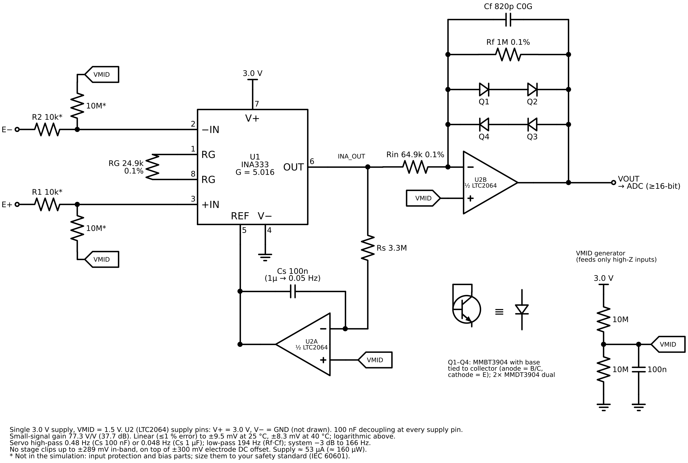

# Lin-log biopotential front end (linear to ~8 mV, logarithmic above)

An ultra-low-power, low-noise front end for ECG/EMG-class signals. It is **linear (≤1 % error) up to
±8.3 mV at 40 °C (±9.5 mV at 25 °C)** and **compresses logarithmically above that**, so a motion
artifact, an electrode-offset step or a lead re-contact never drives anything into saturation.
Simulated in ngspice 42 (`sim/linlog_afe.py`); every number below comes from that run unless it is
marked as a datasheet value.

## Assumptions (change these and re-run the sim)

| Item | Value assumed |
|---|---|
| Signal | Differential biopotential (ECG/EMG), electrode DC offset up to ±300 mV |
| Supply | Single 3.0 V (from an LDO); VMID = 1.5 V |
| Band | 0.05–166 Hz (diagnostic) or 0.5–166 Hz (monitoring), set by one capacitor each |
| Ambient | 15–40 °C (body-worn) |
| Output | Into an ADC referenced to the same 3.0 V rail |

## Circuit



Vector version: [`schematic.svg`](schematic.svg). Regenerate with `python3 schematic.py`. INA333 pin numbers follow TI SBOS445. The LTC2064 supply pins (V+ = 3.0 V, V− = GND) are not drawn. Parts marked * (input protection and electrode bias) are recommended for a real board but are not in the simulation; size them to your safety standard.

How it works:

1. **INA333, G = 5.016**: a low gain, so ±300 mV of electrode offset never saturates its internal
   nodes. It is zero-drift, so its noise is flat down to DC (no 1/f rise inside the ECG band).
2. **DC servo (U2A)** integrates the INA output and drives REF. This is a linear first-order
   high-pass, f = 1/(2π·Rs·Cs) = 0.48 Hz (100 nF) or 0.048 Hz (1 µF). DC is removed **before**
   compression, so the high-pass stays linear.
3. **Lin-log stage (U2B)**: an inverting amplifier with Rf ∥ (anti-parallel pairs of diode-connected
   transistors). For small signals the junctions carry pA–nA and gain = Rf/Rin = 15.4. As |Vout|
   approaches 2·V_BE (≈0.6–0.7 V), junction current takes over and Vout ∝ ln(Vin), at about
   120–140 mV per decade. Cf sets the anti-alias low-pass (1/(2π·Rf·Cf) = 194 Hz).
   The stage inverts: VOUT falls below VMID when E+ is above E−. Swap the electrode
   leads or flip the sign in firmware if you want positive-going output.
4. **Zero-drift op-amps matter**: stage 2's DC gains (noise gain 16.4 for its own offset, ×15.4 for
   the servo's offset) multiply the op-amp offset. With LTC2064 (5 µV max) the knee shift is
   < 0.2 mV, so the knees stay symmetric. A 1.5 mV-max part such as OPA379 could shift a knee by
   up to ~50 mV (≈8 %).

### Parts list (core)

| Ref | Part | Why | Key datasheet values |
|---|---|---|---|
| U1 | TI **INA333** | micropower, zero-drift in-amp | 50 µA typ, 1.8–5.5 V, 50 nV/√Hz (eNI), 1 µVpp 0.1–10 Hz, G = 1 + 100 kΩ/RG |
| U2 | ADI **LTC2064** (dual) | servo + lin-log stage | 1.4 µA/amp typ (2 µA max), 20 kHz GBW, 5 µV max Vos, 220 nV/√Hz, 1.7–5.25 V, RRIO |
| Q1–Q4 | MMBT3904 (or 2× MMDT3904) | log element | vendor Gummel-Poon model used in the sim |
| RG | 24.9 kΩ 0.1 % | G1 = 5.016 | |
| Rin, Rf | 64.9 kΩ, 1 MΩ, 0.1 % | linear gain, knee position | |
| Cf | 820 pF C0G | low-pass 194 Hz (system −3 dB = 166 Hz) | |
| Rs, Cs | 3.3 MΩ, 100 nF / 1 µF (film or C0G/X7R) | servo high-pass | |

## Simulated performance (ngspice, `sim/results/`)

| Metric | Result |
|---|---|
| Small-signal gain | 77.3 V/V (37.7 dB), independent of temperature |
| 1 % compression point | ±10.3 mV @15 °C · **±9.5 mV @25 °C** · **±8.3 mV @40 °C** |
| 5 % compression point | ±11.9 / ±11.2 / ±10.0 mV (15 / 25 / 40 °C) |
| Output at 8 mV / 20 / 50 / 100 / 200 mV (25 °C) | 0.617 / 0.954 / 1.035 / 1.079 / 1.119 V (from VMID) |
| Largest input without any stage clipping | ±289 mV differential, in-band (INA333 output limit at G = 5 on 3.0 V), on top of ±300 mV DC |
| Band (−3 dB) | 0.50–166 Hz (Cs = 100 nF), 0.05–166 Hz (Cs = 1 µF) |
| Input-referred noise | 90.9 nV/√Hz; 1.11 µVrms (0.5–150 Hz brick-wall); 1.50 µVrms total (≈ 10 µVpp) |
| Transient: 40 mV artifact + 120 mV spike + 250 mV offset step | peak output 1.12 V from VMID (limit ±1.45 V); no stage clips |

Hand check of the noise: INA333 √(50² + (200/5.016)²) = 64 nV/√Hz; servo amp 220/5.016 = 44;
stage 2 220·(16.4/15.4)/5.016 = 47; Rin 33/5.016 = 6.5; RSS = 90.8 nV/√Hz, matching SPICE.
IEC 60601-2-27 (ECG monitors) limits noise to 30 µVpp referred to input; this front end uses about a
third of that, before electrode and protection-resistor noise.

### Power budget (3.0 V, datasheet typical)

| Block | Current |
|---|---|
| INA333 | 50 µA |
| LTC2064 (2 amps) | 2.8 µA (4 µA max) |
| VMID divider 2 × 10 MΩ | 0.15 µA |
| **Total** | **≈ 53 µA ≈ 160 µW** |

The in-amp is 94 % of the budget. **AD8235** (40 µA max, 1.8 V, G = 5–200) would cut it further,
at a cost of 76 nV/√Hz RTI at G = 5 and 4 µVpp of 0.1–10 Hz noise, because it is not zero-drift.
Running at 2.5 V saves another ~17 % but lowers the clip limit to about ±239 mV.

## Firmware linearisation (useful for the ML pipeline)

The transfer function has an exact **closed-form inverse**: no lookup table and no iteration.
Writing KCL at the stage-2 summing node:

```
Vin = sign · (Rin / G1) · [ |Vo| / Rf  +  Is(T) · (exp(|Vo| / (2·n·VT)) − 1) ],   VT = kT/q
```

`inverse_model()` in `sim/linlog_afe.py` implements this. Fitting `Is` and `n` once at 25 °C
(fit: Is = 5.38 fA, n = 1.003) reconstructs the input over 1–280 mV with < 0.12 % error at 15, 25
and 40 °C **when the temperature is known**. If temperature is ignored, the error in the log region
reaches 67–117 %. Read a temperature sensor next to Q1–Q4. That 0.12 % comes from a model checking
itself (same junction physics), so on real boards calibrate per unit: inject 2–3 known amplitudes at
two temperatures and fit Is, n (and XTI/EG if needed).

Resolution in the log region: an output error δVo becomes a relative input error δVin/Vin ≈ δVo/52 mV.
With a 12-bit, 3 V ADC (0.73 mV LSB) that is ~1.4 % per LSB, and the quantisation noise (≈2.7 µVrms RTI)
would also exceed the analog noise. **Use a ≥16-bit ADC, or a 12-bit ADC with ≥16× oversampling.**
Also oversample (≥2 kS/s, decimate digitally) or add an RC before the ADC: the analog low-pass is
only first order, and the LTC2064 chops at about 5 kHz.

## Things the simulation does not cover (check on the bench)

- Op-amp/in-amp models are behavioural (datasheet gain, GBW, rail clamps, white noise). They do not
  model offsets, chopper ripple, input-current spikes, the INA333 common-mode/output-swing limits
  (use TI's VCM-vs-VOUT tool) or RFI rectification.
- Unmatched transistors give somewhat asymmetric knees (~1 %). Calibration absorbs this, or use
  dual packages.
- Electrode/skin noise and the series resistors of the defibrillation/ESD protection add noise
  (2 × 10 kΩ ≈ 18 nV/√Hz).
- Inside the log region the superimposed ECG is compressed by the local gain. The inverse restores
  its amplitude, but at the coarser resolution described above.
- If the device must meet IEC 60601-2-25/-27 amplitude accuracy, check that the required input range
  stays in the linear part (the ±5 mV ECG range used in standard front-end design [7] does) and
  document the compression as intended behaviour.

## Run it

```bash
sudo apt-get install ngspice && pip install numpy scipy matplotlib
python3 sim/linlog_afe.py   # writes sim/results/*.png and summary.txt in about 10 s
pip install schemdraw && python3 schematic.py   # redraws schematic.png / .svg
```

## References

1. Texas Instruments, *INA333 Micro-Power, Zerø-Drift, Rail-to-Rail Out Instrumentation Amplifier*,
   SBOS445C. https://www.ti.com/lit/ds/symlink/ina333.pdf
2. Analog Devices, *LTC2063/LTC2064/LTC2065 2 µA, Low IB, Zero-Drift Op Amp* datasheet.
   https://www.analog.com/media/en/technical-documentation/data-sheets/ltc2063-2064-2065.pdf
3. Texas Instruments, *OPA379 family* datasheet, SBOS347 (considered and rejected for offset).
   https://www.ti.com/lit/sbos347
4. Analog Devices, *AD8235 40 µA Micropower Instrumentation Amplifier* datasheet.
5. Analog Devices, MT-077 *Log Amp Basics* (diode vs transdiode log amps, temperature behaviour).
   https://www.analog.com/media/en/training-seminars/tutorials/MT-077.pdf
6. E. Nash, "Ask the Applications Engineer—28: Logarithmic Amplifiers Explained," *Analog Dialogue* 33-3,
   Analog Devices, 1999. https://www.analog.com/en/resources/analog-dialogue/articles/logarithmic-amplifiers-explained.html
7. E. Company-Bosch, E. Hartmann, "ECG Front-End Design is Simplified with MicroConverter,"
   *Analog Dialogue* 37-11, Nov. 2003: in-amp gain limited by ±300 mV electrode offset plus ±5 mV
   signal. https://www.analog.com/en/analog-dialogue/articles/ecg-front-end-design-simplified.html
8. ANSI/AAMI EC11 (diagnostic ECG): tolerance of up to 300 mV electrode polarisation offset.
9. IEC 60601-2-27:2011 (ECG monitoring): ≤30 µVpp input-referred noise.
10. Fairchild/onsemi 2N3904 datasheet: SPICE model (Is = 6.734 fA, Bf = 416.4, Ne = 1.259, …).
11. P. Horowitz & W. Hill, *The Art of Electronics*, 3rd ed., Cambridge Univ. Press, 2015: log
    converters and diode feedback.
12. J. G. Webster (ed.), *Medical Instrumentation: Application and Design*, 4th ed., Wiley, 2010:
    biopotential amplifiers.
