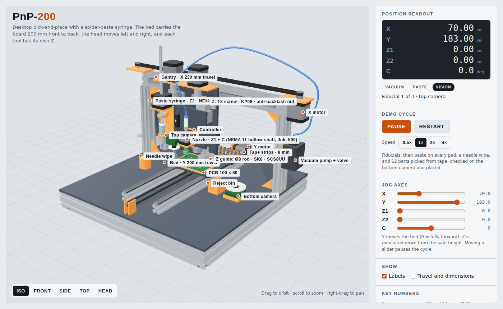
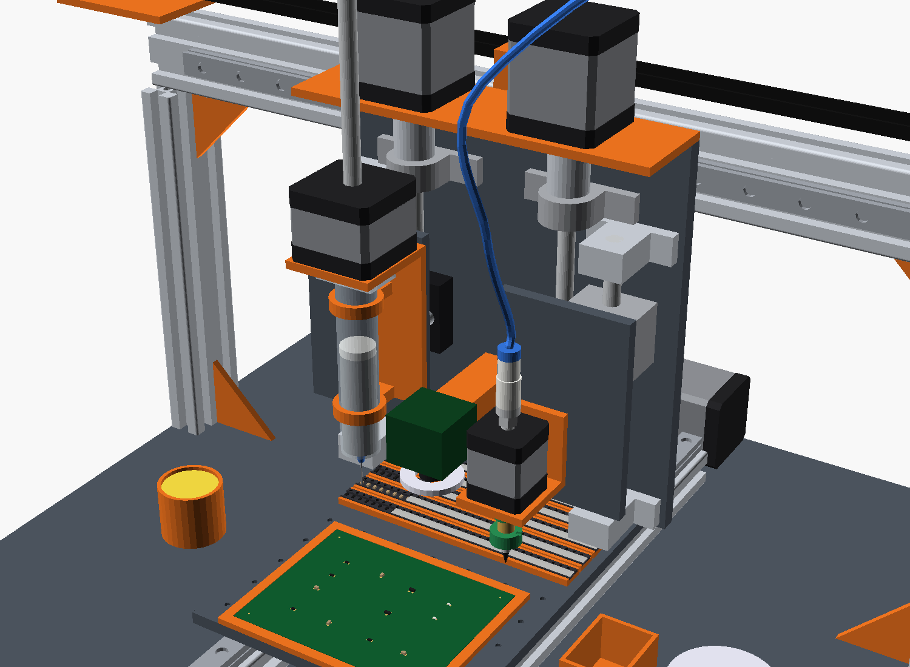
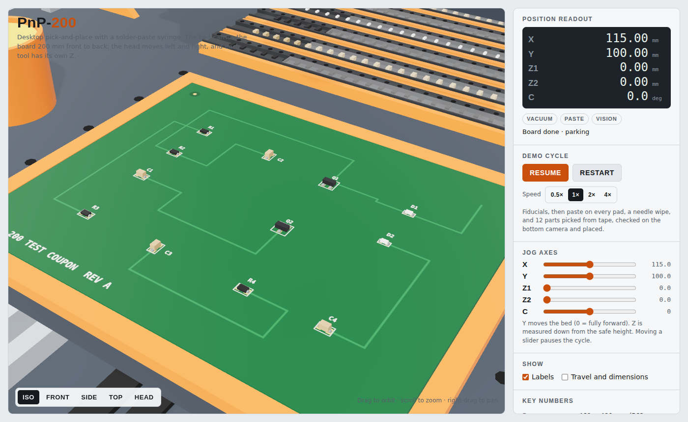

# PnP-200: desktop pick-and-place with solder-paste dispenser

A concept 3D model of a small pick-and-place machine for small boards:

- **Y:** the bed (board plane) moves front to back, **200 mm** travel.
- **X:** the tool head moves left and right on a fixed gantry, 230 mm travel.
- **Z1 + C:** a vacuum pick nozzle moves up and down (40 mm) and rotates.
- **Z2:** a solder-paste syringe moves up and down (40 mm) on its own axis. A small linear stepper pushes its plunger.

The layout follows the hand sketch (front and top views) and the photographed parts:

- **Top view:** a narrow bed carries the board on its front half and the tape strips across its back half.
- **Front view:** the syringe hangs on the left and the nozzle on the right. A vacuum hose loops from the nozzle over the gantry to a pump box on the outside of the right post.
- **Pick-and-place head:**
  - OUKEDA hollow-shaft NEMA 11, 35.6 mm measured.
  - Rotary push-in fitting on top.
  - Juki-type holder with a Juki 500-series nozzle.
- **Paste head:** an AFDE 42SH3402Y-200N NEMA 17 linear stepper whose lead screw runs through the motor and pushes the plunger.
- **Z axis of each head:**
  - T8 lead screw with a flexible coupler, two KP08 pillow-block bearings and an anti-backlash nut block.
  - Behind it, an 8 mm guide rod in two SK8 supports with an SCS8UU bearing block that keeps the plate from turning.

| Tool heads and Z drives | Demo board after one cycle |
|---|---|
|  |  |

## Files

| File | What it is |
|---|---|
| `pnp_200.scad` | Parametric OpenSCAD assembly. This is the source model. Pose sliders are in the Customizer, and `animate = true` runs a motion loop under View › Animate. |
| `viewer.html` | Interactive three.js viewer. You can jog each axis, run the demo cycle (fiducials, paste, pick, bottom-vision check, place), and show travel and overall dimensions. |
| `pnp_200.stl` | The whole assembly exported from OpenSCAD: binary STL, mm, Z up, pose X 115 / Y 100. GitHub shows it in its 3D viewer. |
| `pnp_200.glb` | A colour glTF export from the viewer with the demo board populated. It is Y-up, as the glTF format requires. |

The viewer and the SCAD file share the same parameter names and values. Both exports have the same bounding box to within 0.2 mm (the difference is in how each tool draws the curved hose).

## Coordinate system

Units are mm. +X is right, +Y is toward the back, +Z is up, and the origin is the centre of the frame footprint at table level.

The nozzle, syringe and top camera all point down onto one line, the **tool line** at Y = 0. The gantry cannot move in Y, so a tool reaches bed point (u, v) only when the bed is at `y = −v`. Two things follow from this:

- **Everything the head picks from or places onto rides on the bed.** The board sits on the front half. Six tape strips run across the back half, along X, so the head steps along a strip in X and the bed selects the strip in Y.
- **Fixed stations sit on the tool line**, outside the bed's X range (±70 mm):
  - Up-looking camera at X = +150.
  - Reject bin at X = +95.
  - Needle-wipe cup at X = −150.

## Axes and parts

| Axis | Moves | Travel | Guide | Drive |
|---|---|---|---|---|
| Y | Bed: board fixture and 6 tape strips | 200 mm | 2 × MGN12 rail (370 mm) on 2020 risers, 4 × MGN12H block | NEMA 17 0.9°, GT2 belt, 20T pulley |
| X | Tool carriage | 230 mm | 1 × MGN12H on the 2040 gantry beam | NEMA 17 0.9°, GT2 belt, 20T pulley |
| Z1 | Vacuum nozzle | 40 mm | Ø8 rod in 2 × SK8, 1 × SCS8UU | NEMA 17 0.9° → 5 × 8 coupler → T8 screw in 2 × KP08, anti-backlash nut |
| C | Nozzle rotation | 360° | – | OUKEDA OK28ZK34-084B-HM5 hollow-shaft NEMA 11 |
| Z2 | Paste syringe | 40 mm | Ø8 rod in 2 × SK8, 1 × SCS8UU | Same as Z1 |
| P | Syringe plunger | – | – | AFDE 42SH3402Y-200N NEMA 17 non-captive linear stepper |

- **Frame:** 460 × 480 mm made from 2040 extrusion, plus a 6 mm base plate.
  - Width is 562 mm including the X motor and idler brackets. The hose loop bulges out to X = +305 on the right.
  - Height is 352 mm to the top of the Z motors.
  - Two things stick up higher: the hose loop rises to about 420 mm, and the paste-drive screw sticks up to between 349 mm (empty syringe) and 434 mm (full syringe).
- **Bed:** a 140 × 186 × 6 mm plate. It holds:
  - A 100 × 80 mm board pocket at the front, centred at bed Y = −48.
  - Six 130 mm strips of 8 mm tape at the back, on a 13 mm pitch starting at bed Y = +20. Each strip has 32 pockets at 4 mm. The pick end is on the left and the sprocket holes face the back.
- **Tool offsets in X:** nozzle +40 mm, top camera 0, syringe −40 mm.
- **Vision:**
  - A down-looking camera on the head finds the fiducials and tape pockets.
  - An up-looking camera on the frame checks each part's offset and rotation on the nozzle.
  - This is the usual OpenPnP camera layout, and LumenPnP uses the same one.
- **Vacuum:**
  - The pump and solenoid valve sit on a printed plate on the outside of the right post, below the X motor.
  - A 4 mm hose runs from the valve up past the X motor, over the gantry, and down in front of the Z motors to the rotary fitting on the nozzle motor.
- **Controller:** sits behind the bed's travel (Y > 193 mm), which the bed never reaches.

### Z axis of each head (your parts)

All Z parts sit behind the head's moving plate (the **Z plate**). The tool bolts to the plate's front.

**Front to back (Y):**

| Y (mm) | Part |
|---|---|
| 0 | Tool axis |
| 24 – 30 | Z plate, 6 mm thick |
| 30 – 43 | 13 mm spacer, then the anti-backlash nut block (34 × 36 × 12 mm). The T8 screw runs through the block at Y = 49. |
| 30 – 33 | 3 mm spacer, then the SCS8UU (34 × 30 × 22 mm). The 8 mm rod runs through it at Y = 44, 26 mm beside the screw, on the outer side of each head. |
| 64 | Front face of the carriage plate |

The KP08 bearings (centre height 15 mm) and SK8 supports (centre height 20 mm) bolt to the carriage plate front. The two spacers make their centre heights line up with the nut block and the SCS8UU. The SK8 then clears the Z plate by 1.2 mm.

**Bottom to top (Z, absolute), from the bed upward:**

| Z (mm) | Part |
|---|---|
| 105 | Bottom of the carriage plate, 7.6 mm above the tallest part on the bed |
| 107 – 121 | Lower SK8 |
| 122 – 135 | Lower KP08 |
| 137 – 213 | Nut block travel (36 mm block plus 40 mm stroke) |
| 173 – 243 | SCS8UU travel (30 mm block plus 40 mm stroke) |
| 245 – 259 | Upper SK8 |
| 260 – 273 | Upper KP08 |
| 274 – 299 | Coupler (Ø19 × 25 mm) |
| 300 – 304 | Motor shelf |
| 304 – 352 | Z motor |

- The SK8 and KP08 overlap in X, so they are stacked rather than side by side. The nut block sits below the SCS8UU on the Z plate. This keeps each head 75 mm wide.
- **Cut lengths:**
  - **T8 screw:** about 167 mm.
  - **Rod:** about 152 mm.
  - If yours are longer (the photos suggest about 200 mm), cut them, or raise the shelf and motor by the extra length.
- **Collision check:** a triangle-level test of the viewer geometry checked all moving parts at 109 poses, covering the full X, Y, Z1, Z2 and C range and the station poses. It found no unintended contact.
  - Expected contacts: the screws through their nut blocks, the belt clamps on the belts, and the hose at its two ends.
  - One hit is a real hazard: a full 40 mm nozzle plunge directly over the bottom camera hits its lens (see soft limits below).

#### Things to fix for accuracy

1. **Only the lead screw stops the plate turning.**
   - A single round rod and bearing stops the plate moving sideways and tilting, but the plate can still rotate around the rod. The screw, 26.5 mm away, is what stops that rotation.
   - The tool tip is 51 mm from the rod. Any sideways push from the screw on the nut is therefore multiplied by 51 / 26.5 ≈ **1.9** at the nozzle tip.
   - T8 screws have run-out (wobble) and are not perfectly straight. So 0.02 mm of wobble at the nut moves the tip about 0.04 mm, about the whole ±0.036 mm budget for 0402 parts.
   - The fix is to let the guides do all the guiding, then let the nut float so the screw only pushes up and down. Use an Oldham-type nut coupling, or a nut mount with a little sideways play. Either of these two guide options works:
     - A **second Ø8 rod** (2 more SK8 and 1 more SCS8UU per head) on the other side of the screw.
     - A **miniature linear rail** (MGN9 or MGN12) instead of the rod. It resists rotation by itself.
2. **One short bearing on a long lever.**
   - The SCS8UU is 30 mm long, and the nozzle tip is about 51 mm from the rod.
   - Two bearing blocks spaced apart on the rod, or the rail, resist tilting much better.
3. **The head can drop when the motor is switched off.**
   - A Tr8 × 8 screw (8 mm lead) has a lead angle of about 20°.
   - A screw holds itself only when its lead angle is smaller than the friction angle, which is roughly 6–14° for a POM nut on steel. So the head can slide down by its own weight when the Z motor is unpowered.
   - Keep the Z drivers enabled with holding current, by turning off the firmware's idle motor shut-off. Alternatively, use a 2 mm-lead Tr8 × 2 screw, which holds itself but moves 4 × slower.
4. **Check your screw's lead.** Black OpenBuilds-type nut blocks usually come for Tr8 × 8 (2 mm pitch, 4 starts). Measure how far the nut moves in one turn. The model and the numbers below assume 8 mm.

### C-axis motor and nozzle (from the photos)

The label reads **OUKEDA OK28ZK34-084B-HM5**. I could not find a datasheet for this exact part. It is on resellers' lists, but none give specifications. This is how the model reads the part number:

| Part of the code | Reading | Basis |
|---|---|---|
| `28` | 28 mm frame (NEMA 11) | Same naming as `OK20STH30` (20 mm NEMA 8) and `OK42STH47` (42 mm NEMA 17) |
| `34` | 34 mm body length | Your caliper reads 35.6 mm over the body and the front boss |
| `084B` | Probably 0.8 A per phase, 4 leads | The same code pattern gives `42STH47-1684A` = 1.68 A and Oukeda `OK20STH30-0604B` = 0.6 A. The photo shows 4 wires. |
| `ZK` / `HM5` | Hollow shaft with an M5 thread at the rear | The rotary fitting in the photo screws into it. Comparable PnP motors take a KSH04-M5 fitting there. |

- **Rear stack:** the rear shaft carries a rotary push-in fitting for 4 mm hose, the same type as SMC KSH04-M5 (a ball-bearing rotary one-touch fitting for 4 mm tube, M5 thread). The shaft can therefore turn without twisting the hose.
- **Front shaft:** carries a Juki-type nozzle holder with a green Juki nozzle marked **500**. The nozzle has a spring-loaded tip.
- **Choosing the nozzle size:**
  - Juki's chart lists the 502 for 0402 parts and the 503 for 0603, 0805 and SOT-23.
  - The 500 is at the small end of the range.
  - Check it against your smallest and largest parts, and keep a 503 for 0805 and SOT-23.

**Sizes scaled from the photo** against the 35.6 mm caliper reading, good to about ±2 mm:

| Item | Size |
|---|---|
| Rear: sleeve | Ø6 × 2 mm |
| Rear: M5 hex | 8 mm across flats × 5.7 mm |
| Rear: bearing | Ø11 × 4 mm |
| Rear: rotary body | Ø11 × 13.8 mm |
| Rear: fitting | Ø9.8 × 9.8 mm |
| Rear: release collar | Ø10.3 × 4.6 mm |
| Front: brass holder | Ø9 × 9.5 mm |
| Front: green O-ring | Ø12 × 2 mm |
| Front: lower holder | Ø8 × 7 mm |
| Front: green nozzle flange | Ø15 × 6.5 mm |
| Front: spring | Ø4.5 × 5.5 mm |
| Front: tip | 6.5 mm long |

- **Rear stack total:** 39.9 mm.
- **Motor to tip:** 37 mm from the motor boss to the nozzle tip.
- **Adjusting:** measure your parts and change `C_MOTOR_L`, `NOZ_MOTOR_Z` and the stack in `nozzle_head()` if they differ.

**Before powering it:**
- Measure the coil resistance or ask the seller for the rated current before setting the driver current.
- Check that the hollow bore is clear end to end, since the vacuum path runs through it.

### Paste drive (AFDE 42SH3402Y-200N)

This is a NEMA 17 non-captive linear stepper: the nut is inside the motor and the lead screw passes through it. It stands on a bracket above the 10 cc barrel and pushes the plunger. This is positive-displacement dispensing: the motor pushes out a fixed volume, so the amount does not depend on paste viscosity or on how full the syringe is.

- **Unknowns:**
  - I could not find a datasheet for this part number.
  - The label gives 1.8° and 2 phases. `42SH34` reads as a 42 mm frame and a 34 mm body.
  - `-200N` is probably the 200 mm screw. Confirm the screw's lead and the rated current with the seller.
- **The screw must not turn.** In a non-captive motor the screw only moves up and down if something stops it rotating. Key the pusher plate at the bottom of the screw: give it a flat or a pin that slides in a slot in the bracket.
- **Volume per step:**
  - Volume per full step = plunger area × lead / 200.
  - Example: with a 16 mm bore (measure yours) and a 2 mm lead, one full step pushes about 2.0 mm³, and one 1/16 microstep about 0.13 mm³.
  - A 1 × 1 mm pad printed 0.1 mm thick holds about 0.1 mm³. So each dot is only one or two microsteps.
  - Prefer the 2 mm lead to an 8 mm one, or use a smaller 3–5 cc barrel, to get finer volume steps.
  - Add a small pull-back after each dot so paste doesn't keep oozing.

### Reach check

The carriage centre moves from X −115 to +115 (the viewer shows this as 0 to 230).

| Tool | X offset | Reach in X | Has to reach |
|---|---|---|---|
| Nozzle | +40 | −75 … +155 | Tape pick end −63 … −39; board −50 … +50; reject bin +95; bottom camera +150 |
| Syringe | −40 | −155 … +75 | Board −50 … +50; wipe cup −150 |
| Top camera | 0 | −115 … +115 | Fiducials −45 … +45 |

In Y, the bed centre moves ±100 mm about the tool line.

- **Reach:** the board occupies bed Y −88 … −8 and the tape pockets are at +18.8 … +83.8, so both are well inside ±100.
- **Clearance:** the bed is 186 mm deep, so at the ends of travel its edges reach ±193 mm. That leaves 4 mm to the Y motor at the back.
- **Largest board:** the model's fixture holds a 100 × 80 mm board. With the tape strips where they are, the largest board is about **130 × 95 mm** (keeping a 5 mm fixture rim).

### Height stack (from the table)

| Level | Z (mm) |
|---|---|
| Base plate top | 54 |
| Y rail seat (on 20 mm riser) | 74 |
| Bed underside / top | 87 / 93 |
| Board top (1.6 mm board, 3 mm fixture) | 96 |
| Tape top | 97 |
| Lowest part of the carriage (plate bottom) | 105 |
| Tool tips at Z = 0 (safe height) | 121, which is 25 mm above the board |
| Tool tips at Z = 40 (full plunge) | 81 |
| Nozzle motor at safe height | 158 … 194 |
| Top of the nozzle's push-in fitting at safe height | 233 |
| Paste motor at safe height | 243 … 277 |
| Top-camera ring light | 138, a 42 mm working distance to the board |
| Bottom-camera ring light | 84, 37 mm below a part held at safe height |
| Vacuum pump / valve port | 130 … 190 / 209 |
| Gantry beam | 260 … 300 |
| Top of Z motors | 352 |

Under the bed, the Y belt loop runs at X = 0 in the 33 mm gap between the base plate and the bed. That gap is why the Y rails sit on 20 mm risers.

### Resolution

- **X and Y:** a 20-tooth GT2 pulley moves 20 × 2 mm = 40 mm of belt per turn. The 0.9° motor has 400 full steps per turn, so one full step is **0.1 mm**. At 1/16 microstepping that is 160 microsteps/mm, or 6.25 µm per microstep.
- **Z:** a Tr8 × 8 screw on a 0.9° motor gives **0.02 mm** per full step, and 800 microsteps/mm at 1/16. With a Tr8 × 2 screw it is 0.005 mm.
- **C:** 3200 microsteps per turn gives 0.1125° per microstep.
- **Plunger (P):** lead / 200 per full step: 0.04 mm for an 8 mm lead, or 0.01 mm for a 2 mm lead.

These figures are command resolution, not placement accuracy. Belt stretch, frame stiffness, the Z guide (see above) and camera calibration limit real accuracy. OpenPnP uses the fiducials and bottom vision to correct board position and each part's offset and rotation on the nozzle.

## Motors and drivers

The machine has six motors:

- **X and Y:** the two main axes. X moves the head and Y moves the bed.
- **Z1 and Z2:** one up/down axis on each head.
- **C:** nozzle rotation.
- **P:** the syringe plunger.

### Selected motors

| Axis | Motor | Datasheet values | Drive | Full step | Microstep (1/16) |
|---|---|---|---|---|---|
| X, Y | StepperOnline **17HM19-2004S**, NEMA 17, 0.9° | 2.0 A/phase, 46 N·cm holding, 1.45 Ω, 4.0 mH, 42 × 42 × 48 mm, 370 g | GT2 belt, 20T pulley, 40 mm/rev | 0.100 mm | 6.25 µm |
| Z1, Z2 | StepperOnline **17HM19-2004S** | same | 5 × 8 coupler, Tr8 × 8 screw | 0.020 mm | 1.25 µm |
| C | OUKEDA OK28ZK34-084B-HM5 (you have it) | 1.8°, probably 0.8 A | direct | 1.8° | 0.11° |
| P | AFDE 42SH3402Y-200N (you have it) | 1.8°, rating not confirmed | screw through the motor | lead / 200 | lead / 3200 |

Using the same NEMA 17 on X, Y and both Z screws means one spare type and one driver setting. Any stepper with a 5 mm shaft fits your 5 × 8 coupler, if you want a smaller Z motor. A NEMA 11 still has ample thrust on a Tr8 screw.

### Why the heads get the same accuracy as X and Y

- **What limits a stepper's accuracy is the full step, not the microstep:**
  - Datasheets usually give step-angle accuracy as ±5 % of one full step (no load, non-cumulative).
  - Between full steps the motor is less exact. At 1/16 microstepping, one microstep has only sin(90°/16) ≈ 9.8 % of the holding torque, so friction and detent torque can stop it short.
  - Microstepping adds smoothness and resolution, not accuracy.
  - The figure to compare across axes is therefore **mm per full step**.
- **X and Y use 0.9° motors.** That halves the full step from 0.2 mm (1.8°) to 0.1 mm, which halves the motor's own error in mm (±5 µm instead of ±10 µm).
- **The Z screws are finer still.**
  - A Tr8 × 8 screw turns one 0.9° step into 0.02 mm, five times finer than X and Y. The motor's own error is about ±1 µm.
  - On Z, the limits are the guide and the nut, not the motor (see "Things to fix for accuracy").
- **Repeatability:** the anti-backlash nut removes most of the play. Approach the pick and place heights from the same direction every time (always moving down), so any remaining backlash is always taken up the same way.

### Torque margin

- **X axis:**
  - The carriage with both heads weighs roughly 2 kg, now that it carries two NEMA 17 Z motors. Accelerating it at 3 m/s² takes about 6 N, plus about 1 N of rail friction.
  - At the pulley's 6.37 mm pitch radius, 7 N is about **4.5 N·cm**. The motor holds 46 N·cm at full current.
  - Y moves a lighter load (about 1 kg).
- **Z axes:**
  - A screw turns torque T into thrust F = 2π·η·T / lead.
  - Trapezoidal screws are much less efficient than ball screws. Even at a cautious η = 0.3, an 8 mm lead gives 2π × 0.3 × 0.46 N·m / 0.008 m ≈ **110 N**.
  - The nozzle head weighs about 0.3 kg and the paste head about 0.5 kg, so the margin is very large.

### Speed

- **X and Y:**
  - At 1/16, X and Y need 160 microsteps per mm, so 500 mm/s means 80,000 steps/s.
  - Check that your controller can output that rate.
  - Alternatively, run the drivers at 1/8 and let the TMC2209 interpolate to 256 microsteps internally. That halves the step rate.
- **Z with an 8 mm lead:** the 25 mm plunge from safe height is about 3 turns, a fraction of a second. In practice the safe height only needs to clear your tallest part by a few mm.

### Drivers and settings

Use a **TMC2209** for each of the six motors. It handles 2 A RMS (2.8 A peak) on a 4.75–29 V supply, sets current over UART, and interpolates any input to 256 microsteps. Run the motors on **24 V**, since a higher supply keeps torque up at speed.

| Motor | Suggested driver current | Why |
|---|---|---|
| X, Y (2.0 A rated) | 1.2–1.4 A RMS | 1.4 A RMS is 2.0 A peak, so it stays within the rating whether the 2.0 A is meant as RMS or peak. It also keeps the TMC2209 below its 2 A RMS limit. |
| Z1, Z2 (2.0 A rated) | 0.8–1.0 A RMS | Z needs little torque. Lower current keeps the carriage cooler. Keep them enabled at standstill (see the dropping issue above). |
| C (rating unconfirmed) | Start at 0.4–0.55 A RMS | 0.55 A RMS is 0.8 A peak. Raise it only after you confirm the rated current. |
| P (rating unconfirmed) | Start at 0.5 A RMS | Raise it until the plunger moves the paste reliably, staying within the motor's rating once you know it. |

**Chopper mode:** the TMC2209 offers two.
- StealthChop is silent at standstill and at low speed.
- SpreadCycle is more stable at high speed.
- The driver can switch between them by speed. Use SpreadCycle above a set speed for X/Y.

### Getting the accuracy out of the motors

- **Homing:**
  - Use optical or Hall-effect home switches on X, Y, Z1 and Z2.
  - Add OpenPnP's visual homing: the down camera finds a ~1 mm homing fiducial, so the machine's zero does not depend on how repeatable the switch is.
- **Backlash:** belts have little backlash. OpenPnP's backlash compensation (one-sided positioning) removes what remains.
- **Vision correction:** the board fiducials and the bottom camera correct board position and each part's offset and rotation. This is how hobby machines reach the roughly ±36 µm that 0402 parts need.
- **Missed steps:** open-loop steppers do not report lost steps. The fiducial and bottom-camera checks catch drift on every board.
- **Soft limits:**
  - Over the bed, Z never needs more than about 25 mm.
  - A full 40 mm nozzle plunge at the right end of travel hits the bottom camera's lens.
  - Set OpenPnP's safe Z, and its Z limits per head, accordingly.

### Shopping list

| Qty | Part |
|---|---|
| 4 | StepperOnline 17HM19-2004S (NEMA 17, 0.9°, 2.0 A, 48 mm): X, Y, Z1, Z2 |
| 1 | OUKEDA OK28ZK34-084B-HM5 with rotary fitting, Juki holder and nozzle (already have) |
| 1 | AFDE 42SH3402Y-200N (already have) |
| 2 sets | T8 screw, 5 × 8 coupler, 2 × KP08, anti-backlash nut block (already have) |
| 2 sets | Ø8 rod, 2 × SK8, SCS8UU (already have) |
| 2 + 2 | Spacers: 13 mm under each nut block, 3 mm under each SCS8UU |
| 6 | TMC2209 drivers, or a controller board with at least 6 TMC2209 slots |
| 2 | GT2 20-tooth pulleys, 5 mm bore, 6 mm belt width |
| 1 | GT2 6 mm belt, about 2 m, plus 2 GT2 idlers |
| 1 | 24 V supply, 5 A or more; add your vacuum pump's draw |
| Optional, per head | Second rod, 2 × SK8 and 1 × SCS8UU, or an MGN9/MGN12 rail instead. See "Things to fix for accuracy". |

## Demo cycle (viewer)

One loop takes about 1 minute at 1× speed:

1. Home.
2. Find the 3 fiducials with the top camera.
3. Dispense 26 paste dots.
4. Wipe the needle.
5. Place 12 parts: 4 × 0805 R, 4 × 0805 C, 2 × SOT-23 and 2 × 0603 LED, at 0°, 90° and 180°. For each part:
   1. Pick it from the left end of its tape strip. The bed moves back to bring the strip under the nozzle.
   2. Check it over the bottom camera.
   3. Rotate it, then place it. The bed moves forward to the board.

The tape parts sit with their long axis across the tape, which is along Y. The nozzle therefore turns to `C = rotation − 90°` before placing.

## Design notes

- **A moving bed shakes the placed parts.** Parts sit in wet paste on a bed that accelerates. Paste tack holds small passives, but limit Y acceleration and test with your heaviest parts. With this layout the bed travels 45–155 mm between each pick and its place, so Y acceleration matters more than X.
- **Vacuum hose length:**
  - In the model the hose path gets longer as the head moves left. Give the real hose enough slack for the full X travel, or carry it in a cable chain along the beam.
  - Keep the loop clear of the X belt and motor.
  - Shorter hose volume also means faster pick and release.
- **Paste and needle:**
  - Use a paste sold for dispensing, and match the powder size to the needle bore.
  - J-STD-005 powder sizes: Type 3 is 25–45 µm, Type 4 is 20–38 µm and Type 5 is 15–25 µm.
  - Needle bores (Nordson EFD): 20 ga is 0.61 mm, 22 ga is 0.41 mm.
- **Tape:** 8 mm carrier tape has 1.5 mm sprocket holes on a 4 mm pitch (EIA-481). 0603 and 0805 parts usually come in 4 mm pockets. The pocket centre sits 1.75 + 3.5 mm from the hole-side edge.
- **Controller:**
  - OpenPnP's GcodeDriver works with Smoothieware, Duet3D RepRapFirmware and grblHAL. Marlin also works, with limitations that the OpenPnP wiki describes.
  - The controller needs 6 motor axes: X, Y, Z1, Z2, C and P.
  - It also needs outputs for the vacuum pump, the valve and the ring lights.
- **Not modelled:**
  - Cable chains (4 motors and the camera USB on the head).
  - Endstops.
  - The Y-drive details under the bed.
  - The anti-rotation key on the paste screw.
  - Printed-part details. The orange parts are placeholders for size and position.

## Using the files

**OpenSCAD** (2021.01 or newer):

- Open `pnp_200.scad` and press F5 to preview.
- Set the pose (X, Y, Z1, Z2, C) in the Customizer.
- To run the motion loop, set `animate = true`, then use View › Animate with FPS 10 and Steps 200.
- F6 then F7 exports an STL. The full assembly takes about 1 minute.
- All dimensions are named constants in the `[Hidden]` section. Change them to match the parts you buy. The Z stack is computed from the part sizes, so changing a size moves the parts around it.

**Viewer:**

- Open `viewer.html` in a browser. It loads three.js 0.160 from jsDelivr, so it needs an internet connection.
- Drag to orbit, scroll to zoom and right-drag to pan.
- Moving a jog slider pauses the demo.

## References

- **Linear guides:**
  - HIWIN, *MG Series Miniature Linear Guideway catalogue* (MGN9/MGN12 rail and block dimensions): <https://motioncontrolsystems.hiwin.com/Asset/MG-Series-Catalog.pdf>
  - HIWIN MGN12H product page: <https://www.hiwin.de/en/Products/Linear-guideways/Blocks/Series-MGN-MGW/MGN/MGN12HZ0CM/p/MGN12HZ0CM>
- **Z parts:**
  - SCS8UU (34 × 30 × 22 mm, shaft height 11 mm, M4 holes 24 × 18 mm): <https://www.makeralot.com/scs8uu-linear-bearing-block-for-3d-printer-p109/>
  - SK8 (height 32.8 mm, width 42 mm, thickness 14 mm, shaft height 20 mm, M5 holes 32 mm apart): <https://probots.co.in/linear-rail-shaft-guide-support-8mm-diameter-sk8.html>
  - KP08 (length 55 mm, width 13 mm, height 28 mm, hole spacing 42 mm, centre height 15 mm): <https://www.makerstore.com.au/product/bear-kp08/>, <https://spool3d.ca/kp08-pillow-block-bearing/>
  - OpenBuilds anti-backlash nut block for 8 mm metric lead screw (Tr8 × 8, 34 × 36 × 12 mm, M5 holes 20 mm apart): <https://us.openbuilds.com/anti-backlash-nut-block-for-8mm-metric-lead-screw/>, <https://ratrig.com/hardware2/openbuilds/anti-backlash-nut-block-for-8mm-metric-acme-lead-screw.html>
- **Screws:**
  - Lead-screw self-locking (lead angle vs friction angle) and efficiency: <https://en.wikipedia.org/wiki/Leadscrew>, <https://www.machinedesign.com/mechanical-motion-systems/article/21834567/choosing-the-best-lead-screw-for-a-linear-motion-application>
  - Decoupling a lead-screw nut from the guided carriage (Oldham-type nut couplings): <https://www.printables.com/model/564649-wobble-free-z-axis-oldham-coupler-and-hot-end-save>
- **Juki nozzles:** nozzle sizes by part (502 for 0402, 503 for 0603/0805): <https://groups.google.com/g/openpnp/c/Ho_JNtZsch8>, and the Juki nozzle application catalogue: <http://avipre.com/products/smt&tht/juki//Juki%20-%20Nozzle%20Catalogue-Rev-C3.pdf>
- **Motor sizes:**
  - NEMA 17 (42 mm face, 31 mm hole spacing): <https://eu.aspina-group.com/en/learning-zone/columns/what-is/034/>
  - NEMA 8 (20 mm) and NEMA 11 (28 mm): <https://www.omc-stepperonline.com/nema-8-stepper-motor>, <https://www.omc-stepperonline.com/nema-11-stepper-motor>
- **Hollow-shaft PnP motors:**
  - RobotDigg NEMA 11 hollow-shaft stepper for pick and place (34 mm body, 5 mm hollow front shaft for Juki holders, rear M5 for KSH04-M5): <https://www.robotdigg.com/product/798/NEMA11-hollow-shaft-stepper-for-Pick-and-Place-Machine>
  - OK28ZK34-084B-HM5 reseller listing (no specifications): <https://www.amazon.com/OK20STH30-0604B-NK2-5-OK42STH47-1684AYT-OK35STH34-1004A-0K28ZK34-084B-HM5-0K20HC30-NK2-5-HM5/dp/B0FDFDHM9Y>
- **Part-number patterns:**
  - 42STH47-1684A at 1.68 A (Joy-it NEMA17-01 datasheet): <https://asset.conrad.com/media10/add/160267/c1/-/en/001597325DS00/list-technickych-udaju-1597325-joy-it-krokovy-motor-nema-17-01-nema-17-01-04-nm-168-a-prumer-hridele-5-mm.pdf>
  - Oukeda OK20STH30-0604B at 0.6 A: <https://compacttool.ru/motor-shagoviy-nema-8-ok20sth30-0604a-18-06a>
- **Linear steppers with T8 screws:** a NEMA 17 with an integrated T8 screw (40 µm per full step with an 8 mm lead): <https://www.pololu.com/product/2268>
- **Pneumatic fittings:** SMC, *Rotary One-touch Fittings, Series KS/KX* (KSH04-M5: 4 mm tube, M5, ball-bearing rotary fitting): <https://www.smcpneumatics.com/pdfs/KS.pdf>
- **Belts:** GT2 2 mm pitch pulleys (20T pitch diameter 12.73 mm): <https://www.powerdrive.com/Downloads/ECatalogs/TimingBeltDrive/GT2%20Timing%20Pulley%20-%202mm%20Pitch.pdf>
- **Tape:** ECIA EIA-481-F, *Embossed and punched carrier taping of surface mount components*: <https://standards.globalspec.com/std/14462438/EIA-481-F>
- **Solder paste and dispensing:**
  - IPC J-STD-005A, *Requirements for Soldering Pastes* (powder types): <https://www.electronics.org/TOC/IPC-J-STD-005A.pdf>, and the Indium summary: <https://www.indium.com/blog/solder-powder-types-3-4-5-6-7/>
  - Nordson EFD dispensing tips catalogue (gauge vs bore): <https://pdf.directindustry.com/pdf/nordson-efd/dispensing-tips/35688-146801.html>
  - *Pushing Paste*, ASSEMBLY magazine (time-pressure vs motor-driven piston and auger dispensing): <https://www.assemblymag.com/articles/82788-pushing-paste>
- **OpenPnP:**
  - Wiki, *Motion Controller Firmwares*: <https://github.com/openpnp/openpnp/wiki/Motion-Controller-Firmwares>
  - Wiki, *Backlash Compensation*: <https://github.com/openpnp/openpnp/wiki/Backlash-Compensation>
  - Wiki, *Fiducial Locator* (visual homing): <https://github.com/openpnp/openpnp/wiki/Fiducial-Locator>
  - Forum, *Reliable Placement of 0402-Sized Components* (±0.036 mm tolerance for 0402): <https://groups.google.com/g/openpnp/c/yQYekBUfxvA>
- **X/Y/Z motor:** StepperOnline 17HM19-2004S (NEMA 17, 0.9°, 2.0 A, 46 N·cm, 48 mm): <https://www.omc-stepperonline.com/nema-17-bipolar-0-9deg-46ncm-65-1oz-in-2a-2-9v-42x42x48mm-4-wires-17hm19-2004s>
- **Drivers and stepper accuracy:**
  - Analog Devices (Trinamic), *TMC2209 datasheet* (2 A RMS / 2.8 A peak, 4.75–29 V, 256-microstep interpolation, StealthChop/SpreadCycle): <https://www.analog.com/media/en/technical-documentation/data-sheets/TMC2209_datasheet_rev1.09.pdf>
  - MICROMO, *Microstepping: Myths and Realities* (incremental torque per microstep): <https://www.micromo.com/technical-library/stepper-motor-tutorials/microstepping-myths-and-realities>
  - Leadshine 42HS series datasheet (step-angle accuracy ±5 %, full step, no load): <https://ww1.microchip.com/downloads/en/DeviceDoc/Leedshine%2042HS03%20Stepper%20Motor%20Datasheet.pdf>
  - Thrust formula F = 2π·η·T / lead: <https://www.moonsindustries.com/article/thrust-generation-principle-linear-lead-screw-motor>
- **LumenPnP:** an open-source OpenPnP machine with the same up- and down-camera layout: <https://github.com/opulo-inc/lumenpnp>
